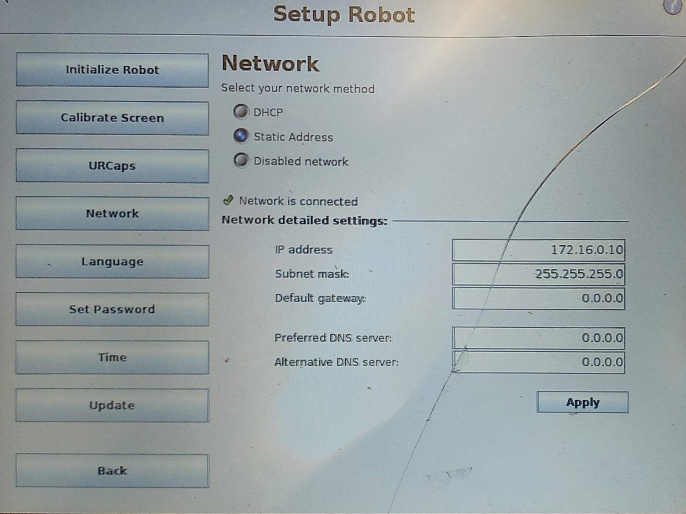
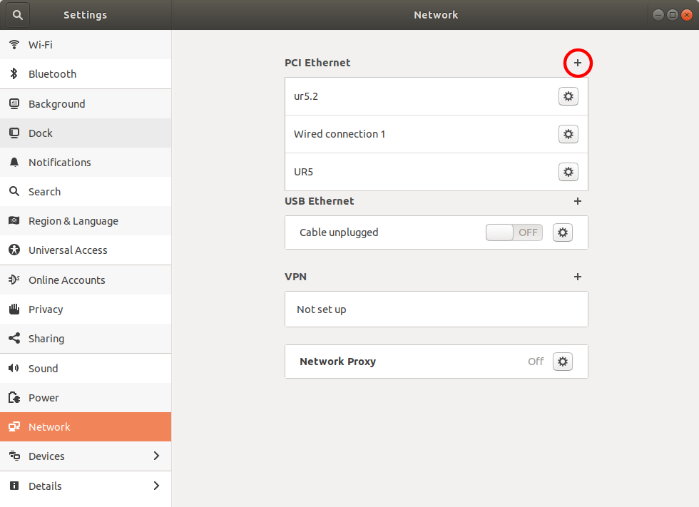
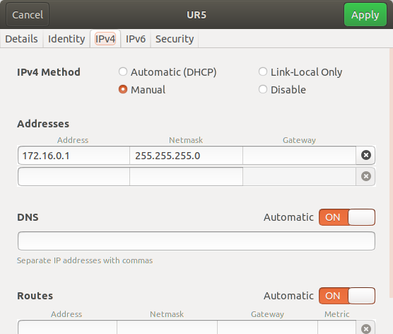
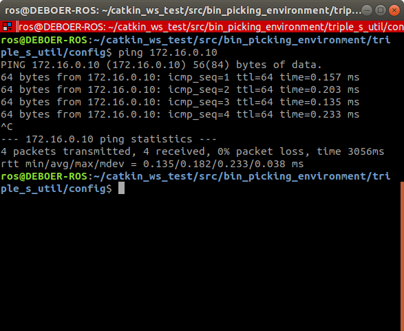
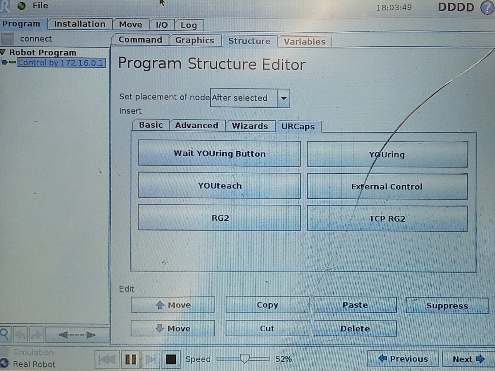

# Connecting ROS to UR5
This document explains the process of connecting the UR5 robot to an computer running ROS. This tutorial is written for using ROS-melodic and an UR5 from the CB3 series.

This turial is only valid when configuring a computer running ROS and an UR5 that are directly connected to each other over an ethernet cable (without any devices in between). 
To configure the devices, two IPv4-addresses are needed. For this tutorial the following adresses are chosen:
 - `172.16.0.10` for the UR5
 - `172.16.0.1` for the computer running ROS

Notice they are both on the same subnet. 

### Step 1: Enabling a network connection on the UR5
On the startup screen on the UR5 choose *Setup Robot* > *Network*. Insert the IP address for the UR5 and set the subnetmask to `255.255.255.0`.



### Step 2: Configure the network on the ROS computer
Connect the UR5 directly (without a router) to a computer using an ethernet cable. In Ubuntu open *settings* and go to *network settings*. Click the `+` icon next to the ethernet options. If you have multiple ethernet adapters, make sure to pick the one the UR5 is connected to.



A window pops up to configure a new ethernet connection. Under the identity tab you can give the profile a name and make sure to select the MAC-address of the used ethernet adapter. Leave the cloned address and MTU fields untouched.

Go to the IPv4 tab and set it to manual. Enter a network address that matches the same netmask address of the UR5. So, if the IP address of the UR5 is `172.16.0.10` and the netmask is `255.255.255.0`, the first three bytes should match, and the last byte should be unique. In this case the address `172.16.0.1` is chosen. Also fill in the netmask. Leave all other options empty.



Disable IPv6 on the IPv6 tab, and make sure no password is set on the Security tab. Now, you can click on apply. Make sure to activate the new profile by clicking on it.

You can test the connection by pinging the UR5. Open a terminal and type in the following command:

```bash
$ ping <IP of UR5>
```

In our case the command is `ping 172.16.0.10`. The result should be something along the lines of: `64 bytes from 172.16.0.10` repeated over an over again. If nothing appears, the devices are not connect to each other.



### Step 3: Install URCap for external control
[Download](https://github.com/UniversalRobots/Universal_Robots_ROS_Driver/blob/master/ur_robot_driver/resources/externalcontrol-1.0.4.urcap) the URCap file and save it to your disk. This tutorial is based on version `1.0.4` of the URCap.

Copy the file to the `/programs` folder on the UR5. This can be done by using a USB-stick, or by using `scp`:
```bash
$ scp externalcontrol-1.0.4.urcap root@172.16.0.10:/programs
```

The default password for root is `easybot` (remember to change this if the robot is connected to a network!).

Go to the welcome screen once again, and choose *Setup Robot* > *URCaps* and click the `+`-button. Select the `externalcontrol-1.0.4.urcap` file and press open. Restart the UR5 by clicking the restart button.


### Step 4: Configuring the UR5
Create a new program on the UR5. Go to the *installation* tab and select *External Control*. If external control is not in the list, the URCap file is not installed correctly. Fill in the IP-address of the ROS computer under host IP and host name.


Also open the *Ethernet/IP* settings and make sure they are **disabled**. This may seem counterintuitive, but otherwise ROS won't be able to control the robot.

### Step 5: Creating a calibration file
To be able to precisely control the robot, it is necessary that ROS has information about the calibration of the robot. This can automatically be generated by using the following command:

```bash
$ roslaunch ur_calibration calibration_correction.launch robot_ip:=<robot_ip>
```

This will save a file to `~/.ros/robot_calibration.yaml`, which can be copied to our config. The file can also be renamed (in this case to `ur5_calibration.yaml`).
```bash
$ mv ~/.ros/robot_calibration.yaml $(rospack find triple_s_util)/config/ur5_calibration.yaml
```

There is already a configuration file present in this repository. This is the calibration file for the UR5 at Saxion Enschede.

### Step 6: Creating a robot program on the UR5
The program that was created at step 4, doesn't have any instructions in it yet. Go to *structure* > *URCaps* and add a *External Control* block.



To easily reuse this program, you can save it on the robot.

### Step 7: Launch
First, launch the ROS program that connects to the robot.
```bash
$ roslaunch triple_s_util physical_robot.launch robot_ip:=<ip of robot>
```

After this has successfully launched, click start on the UR5. The console on the ROS computer should now say `Ready to receive commands`.

This can be tested by using `rqt` and loading a `joint trajectory controller` plugin. This will allow you to control all the joints.