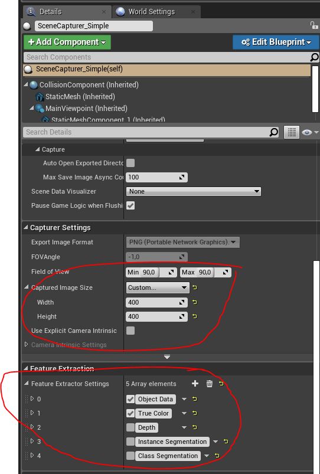

# NDDS tutorial

By following the original tutorial found [here](https://github.com/TripleSBinPicking/bin_picking_environment/blob/master/documentation/resources/NDDS.pdf), most things will be explained. In this file there will be some addendums to the tutorial for points that are not clear or things that are unnecessary.

## Installation
In step 1, the original writers want you to get the file via github lfs, but this does not work at the time. So for an alternative we provide a compressed version of the code [here](https://github.com/NVIDIA/Dataset_Synthesizer/releases/download/1.2.2/ndds_1.2.2.zip).

## Starting NDDS
To start NDDS just open the NDDS.uproject file that is in the \Source directory of the NDDS folder.

## Making your own synthetic dataset
To make your own sysnthetic dataset for use with DOPE, there are a few things to keep in mind.
### Making the level
For making the level, the original tutorial can be followed from page 12.

### Adding your own objects
Adding your own objects into the project is rather easy. First make the object in for example Blender and export it as an .fbx file. Then drag it into a seperate folder and accept the import popup. An example for a folder structure is shown in the figure below. Here we have added a folder under Content named Objects in which seperate folders for each object is made. After this, you can drag the object into the map and before the camera. Try to position it in a way that the scene capturer has a good view on it. 

### Adding random movement and rotation to objects
After adding your objects, to get the random movement and rotation we will use a blueprint. Click on one of the objects that you want to use and select the blue button with Blueprint/Add Script. Then make the blueprint shown under here. Blueprint components can be added by right clicking on the surface and typing the name of the component you want to add. The delay in this blueprint is added so the object_settings.json that NDDS outputs a regular fixed model transform instead of it being made when it is already moving and rotating.

### Export options for training with DOPE
To train an AI with DOPE, not all possible image options are needed. For DOPE, only the Object Data and True Color elements are needed. This can be changed by selecting your SceneCapturer_Simple which was setup in the NDDS tutorial and go under details to Feature Extraction. Then deselect all array elements except for Object Data and True Color.
Another important setting that has to be changed is the Captured Image Size. This has to be set to 400 x 400 pixels, because DOPE only takes this format for training.

Read next:  
[Training DOPE](Training%20DOPE.md)
