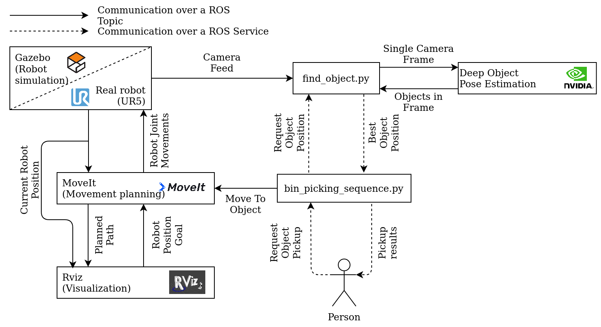

# Object picking overview
This document will give an overview of how the system works when it is trying to pick up specific objects from a bin.

## Basic overview


The image gives a simple high-level overview of how the system works. Settings up Gazebo, MoveIt and Rviz is explained in the previous documents, as well as setting up DOPE. Note that Gazebo can be replaced with the real robot if necessary.

Two other scripts are started in order to pick up objects.

### [`find_object.py`](../triple_s_util/scripts/bin_picking/find_object.py)
The find object script starts a [ROS service](http://wiki.ros.org/Services). This service can be called and has a single parameter: the name of the object we want to pick up. Once the service is finished it will return wether it has found an object of this type and where this object is located (as described below and in the [service file](../triple_s_util/srv/ObjectRequest.srv)).

```
string object_name
---
bool found_object
geometry_msgs/PoseStamped object_pose
```

If an object is requested, it sends a single frame of the camera feed to DOPE. DOPE doesn't constantly analyze the camera feed, because this takes a lot of processing power and is not needed for this system. Once DOPE has analyzed the image, the find object script will filter out the objects of the type that was requested. If there are multiple objects available, the script will determine which objects is the best candidate for picking up.

The script that invokes the service is the bin_picking_sequence.py script.

### [`bin_picking_sequence.py`](../triple_s_util/scripts/bin_picking/bin_picking_sequence.py)

The bin picking sequence script is in charge of everything. It request object positions from the find object script and converts them into grasp positions for the robot.